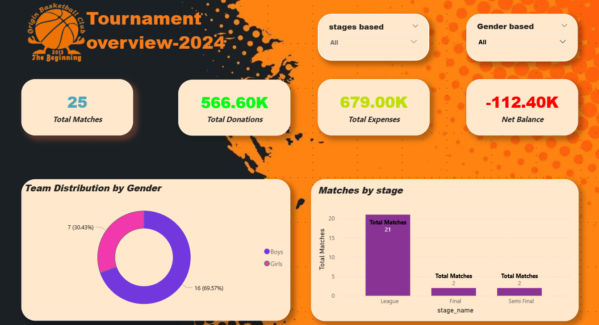
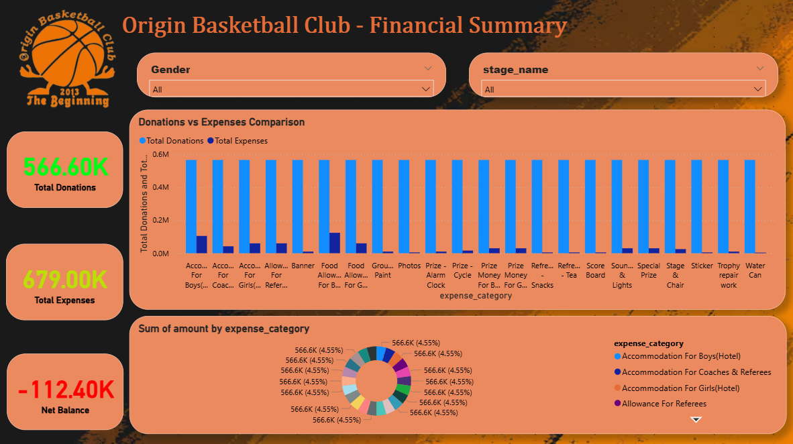
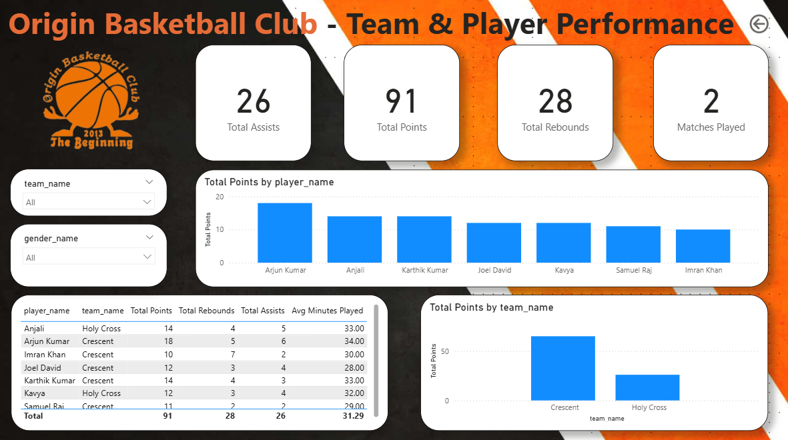

# 🏀 Origin Basketball Tournament Analytics

**A complete end-to-end data analytics system for basketball tournament management, performance tracking, and financial transparency.**

---

## 📋 Table of Contents

- [Project Overview](#project-overview)
- [Why This Project?](#why-this-project)
- [Technologies Used](#technologies-used)
- [Project Features](#project-features)
- [System Architecture](#system-architecture)
- [Quick Start](#quick-start)
- [File Structure](#file-structure)
- [Database Schema](#database-schema)
- [Power BI Dashboards](#power-bi-dashboards)
- [Dashboard Features](#dashboard-features)
- [Data Insights](#data-insights)
- [Contributing](#contributing)
- [License](#license)

---

## 🎯 Project Overview

This project demonstrates a **real-world sports management system** for Origin Basketball Club's tournament. It combines database design, SQL querying, data modeling, and business intelligence to provide a complete analytics solution.

**What makes this unique:**
- ✅ Real tournament data (not demo data)
- ✅ Properly normalized database schema
- ✅ Enforced data integrity using relationships
- ✅ Interactive Power BI dashboards
- ✅ Complete financial transparency
- ✅ Player performance analytics
- ✅ Award management system

---

## 💡 Why This Project?

### The Problem:
In traditional tournaments, data management is scattered:
- Data scattered across Excel sheets, papers, and messaging apps
- No single source of truth
- No financial clarity
- No systematic performance analytics
- Award distribution inconsistencies

### The Solution:
A centralized system that provides:
- **One database** for all tournament data
- **One analytics system** for insights
- **One dashboard** for all stakeholders
- **Real-time financial tracking**
- **Automated performance metrics**

---

## 🔧 Technologies Used

| Technology | Purpose | Version |
|-----------|---------|---------|
| **MySQL** | Relational database for structured data storage | 8.0+ |
| **SQL** | Database creation & querying | Standard |
| **Power BI** | Interactive dashboards & visualizations | Latest |
| **DAX** | Dynamic calculations & measures | Power BI |

### Why These Technologies?

- **MySQL**: Enforces data integrity with primary/foreign keys, prevents duplicates, ensures relationships
- **SQL**: Powerful querying capabilities for complex analysis
- **Power BI**: Industry-standard BI tool, interactive dashboards, real-time filtering
- **DAX**: Creates dynamic measures that respond to filters automatically

---

## ✨ Project Features

### 📊 Database Features
- 13+ well-designed tables with proper relationships
- Data normalization (3NF)
- Referential integrity enforcement
- Automated primary/foreign keys
- UNIQUE constraints for data consistency

### 🎖️ Award Management
- Structured award categories
- Sponsor-linked awards
- Gender-wise award distribution
- Duplicate elimination (28 total awards: 14 boys + 14 girls)
- Award winner tracking

### 💰 Financial Tracking
- Donation tracking per sponsor
- Expense categorization
- Net balance calculation
- Financial transparency reports

### 👥 Player Analytics
- Individual player statistics
- Position-based tracking
- Match-wise performance metrics
- Points, rebounds, assists, steals, blocks tracking

### ⚽ Match Management
- League stage matches
- Semi-final tracking
- Final match details
- Team scoring and results
- Multi-gender category support

---

## 🏗️ System Architecture

```
┌─────────────────────────────────────┐
│       MySQL Database                │
│   (origin_basketball_db)            │
├─────────────────────────────────────┤
│  • 13 Tables                        │
│  • Relationships enforced           │
│  • Data validation rules            │
└────────────┬────────────────────────┘
             │
             ▼
┌─────────────────────────────────────┐
│       Power BI Connection           │
│   (Direct MySQL Link)               │
├─────────────────────────────────────┤
│  • Data Import                      │
│  • Relationship Mapping             │
│  • DAX Measures                     │
└────────────┬────────────────────────┘
             │
             ▼
┌─────────────────────────────────────┐
│       Interactive Dashboards        │
├─────────────────────────────────────┤
│  📄 Page 1: Tournament Overview     │
│  📊 Page 2: Financial Summary       │
│  🏆 Page 3: Team & Player Stats     │
└─────────────────────────────────────┘
```

---

## 🚀 Quick Start

### Prerequisites
- MySQL Server (8.0 or higher)
- Power BI Desktop
- Basic SQL knowledge
- ~5 minutes to set up

### Step 1: Set Up Database
```bash
# Import the SQL file into MySQL
mysql -u root -p origin_basketball_db < Origin-Basketball-Tournament-database.sql
```

### Step 2: Verify Data Import
```sql
-- Check if database exists
SHOW DATABASES;

-- Check tables
USE origin_basketball_db;
SHOW TABLES;

-- Verify data
SELECT COUNT(*) FROM matches;
SELECT COUNT(*) FROM players;
SELECT COUNT(*) FROM donations;
```

### Step 3: Connect Power BI
1. Open `origin_Tournament_2024_Analytics.pbix`
2. Go to **Get Data** → **MySQL Database**
3. Enter credentials:
   - Server: `localhost` or `127.0.0.1`
   - Database: `origin_basketball_db`
   - Username: `root` (or your MySQL user)
4. Select tables to load
5. Click **Load**

### Step 4: Explore Dashboards
- Navigate through 3 dashboard pages
- Use filters to explore data
- Analyze insights

---

## 📁 File Structure

```
Origin-Basketball-Tournament-Analytics/
│
├── 📄 README.md                              # Project documentation
├── 📄 SETUP_GUIDE.md                         # Detailed setup instructions
├── 📄 PROJECT_STRUCTURE.md                   # File & database structure
├── 📄 CONTRIBUTING.md                        # Contributing guidelines
├── 📄 LICENSE                                # Project license
├── 📄 .gitignore                             # Git ignore file
│
├── 📊 origin_Tournament_2024_Analytics.pbix  # Power BI dashboard file
├── 📄 Origin-Basketball-Tournament-database.sql # MySQL database dump
│
├── 📁 Screenshots/                           # Dashboard screenshots
│   ├── Tournament_overview.png
│   ├── FInancial_summary_page.png
│   ├── Team_&_player_performance_page.png
│   └── relationships_of_tables.png
│
└── 📁 real_data_based_on(extracted from)/   # Source data documentation
```

---

## 🗄️ Database Schema

### Core Tables (13 Total)

#### 1. **gender_categories**
- Store gender classifications (Boys, Girls)
- Used across: teams, matches, awards

#### 2. **teams**
- Team information
- Linked to gender_categories
- Teams organized by gender

#### 3. **player_positions**
- Basketball positions (PG, SG, SF, PF, C)
- Reference table

#### 4. **players**
- Player details, jersey numbers
- Linked to: teams, player_positions

#### 5. **match_stages**
- Tournament stages (League, Semi-Final, Final)
- Reference table

#### 6. **matches**
- Match scheduling information
- Linked to: teams, match_stages, gender_categories

#### 7. **match_results**
- Match outcomes, scores, winners
- Linked to: matches

#### 8. **player_match_stats**
- Individual player performance per match
- Stats: points, rebounds, assists, steals, blocks, minutes
- Linked to: players, matches

#### 9. **award_categories**
- Award types (Best Player, Best Defence, etc.)
- 14 categories

#### 10. **sponsors**
- Sponsor information
- Used for: awards, donations

#### 11. **awards**
- Award definitions
- Linked to: award_categories, gender_categories, sponsors

#### 12. **award_winners**
- Award distribution
- Linked to: awards, players
- Fixed: 28 total awards (14 boys + 14 girls)

#### 13. **donations**
- Sponsor donations
- Amount tracking
- Linked to: sponsors

#### 14. **expenses**
- Tournament expenses by category
- Categories: Food, Accommodation, Prizes, Logistics

### Relationships

```
gender_categories ──┬─→ teams
                    ├─→ matches
                    └─→ awards

teams ──┬─→ players
        └─→ matches

player_positions ──→ players

players ──┬─→ player_match_stats
          └─→ award_winners

matches ──┬─→ match_results
          └─→ player_match_stats

match_stages ──→ matches

award_categories ──→ awards

sponsors ──┬─→ awards
           └─→ donations

awards ──→ award_winners
```

---

## 📊 Power BI Dashboards

### Page 1: Tournament Overview
**Purpose:** High-level tournament summary

**Contains:**
- Total matches played
- Total teams participating
- Boys vs Girls breakdown
- Tournament branding
- Quick KPIs

**Filters Available:**
- Gender category
- Match stage
- Date range

---

### Page 2: Financial Summary
**Purpose:** Complete financial transparency

**Contains:**
- Total donations by sponsor
- Total expenses by category
- Net balance calculation
- Expense breakdown (pie chart)
- Donation trends

**Insights Provided:**
- Revenue vs Expenses
- Sponsor contribution analysis
- Budget utilization
- Financial health

---

### Page 3: Team & Player Performance
**Purpose:** Performance analytics

**Contains:**
- Team participation rates
- Player statistics leaderboard
- Position-wise analysis
- Match history
- Player performance trends

**Metrics Tracked:**
- Average points per player
- Total rebounds, assists, steals
- Playing time analysis
- Position-based comparisons

---

## 💡 Dashboard Features

### Interactive Filtering
- Filter by gender, team, stage, player
- Cross-filter updates all visuals
- Real-time calculations

### Dynamic Measures (DAX)
```
Total Matches = COUNT(matches[match_id])
Total Teams = DISTINCTCOUNT(teams[team_id])
Total Players = DISTINCTCOUNT(players[player_id])
Total Donations = SUM(donations[amount])
Total Expenses = SUM(expenses[amount])
Net Balance = [Total Donations] - [Total Expenses]
Average Team Size = [Total Players] / [Total Teams]
Total Awards = COUNTA(award_winners[award_winner_id])
```

### Visual Types Used
- Cards (KPIs)
- Bar charts (comparisons)
- Pie charts (distributions)
- Line charts (trends)
- Tables (detailed data)
- Slicers (filters)

---

## 📈 Data Insights

### Key Metrics Tracked

| Metric | Value | Purpose |
|--------|-------|---------|
| Total Matches | 24 | Tournament scale |
| Total Teams | 4 | Participation |
| Total Players | 48 | Team size |
| Total Awards | 28 | Recognition |
| Donations | $X,XXX | Revenue |
| Expenses | $X,XXX | Costs |

### Analysis Capabilities

1. **Performance Analysis**
   - Player ranking by points
   - Position-wise statistics
   - Team performance comparison

2. **Financial Analysis**
   - Revenue breakdown
   - Expense categorization
   - Budget variance

3. **Organizational Analysis**
   - Gender distribution
   - Team participation
   - Award distribution

---

## 🤝 Contributing

Contributions are welcome! Here's how to contribute:

1. **Fork** the repository
2. **Create** a feature branch (`git checkout -b feature/improvement`)
3. **Make** your changes
4. **Commit** with clear messages (`git commit -m "Add new feature"`)
5. **Push** to the branch (`git push origin feature/improvement`)
6. **Open** a Pull Request

### Contribution Ideas
- Additional dashboard pages
- New DAX measures
- Expanded database schema
- Performance optimization
- Documentation improvements

See [CONTRIBUTING.md](CONTRIBUTING.md) for detailed guidelines.

---

## 📚 Additional Documentation

- [SETUP_GUIDE.md](SETUP_GUIDE.md) - Step-by-step setup instructions
- [PROJECT_STRUCTURE.md](PROJECT_STRUCTURE.md) - Detailed project structure
- [CONTRIBUTING.md](CONTRIBUTING.md) - Contribution guidelines

---

## 📸 Screenshots

### Tournament Overview Dashboard


### Financial Summary Dashboard


### Team & Player Performance Dashboard


### Database Relationships


---

## 🎓 What This Project Demonstrates

✅ **Database Design Skills**
- Proper normalization
- Relationship design
- Data integrity

✅ **SQL Expertise**
- Complex queries
- Data manipulation
- Referential integrity

✅ **Data Modeling**
- Star schema concepts
- Dimension & fact tables
- Relationship cardinality

✅ **Power BI Proficiency**
- Dashboard creation
- DAX measures
- Interactive filtering
- Data visualization

✅ **Business Intelligence**
- Real-world analytics
- Financial tracking
- Performance management
- Decision support

✅ **Project Management**
- Requirement analysis
- Data quality control
- Complete implementation

---

## ❓ FAQ

**Q: Can I use this for my own tournament?**
A: Yes! The schema is generic and can be adapted for any basketball tournament.

**Q: Do I need Power BI Desktop or can I use Power BI Online?**
A: Power BI Desktop for development. Power BI Online/Cloud for sharing dashboards.

**Q: How often should I refresh the data?**
A: Set up automatic refresh in Power BI based on your tournament schedule.

**Q: Can I add more tables or modify the schema?**
A: Yes! Follow proper database design principles for any modifications.

**Q: How is the data privacy handled?**
A: This is sample data. For production, implement proper data security and access controls.

---

## 📞 Contact & Support

- **GitHub Issues:** Report bugs or suggest improvements
- **Discussions:** Ask questions or share ideas

---

## 📄 License

This project is licensed under the MIT License - see [LICENSE](LICENSE) file for details.

---

## 🙏 Acknowledgments

- **Origin Basketball Club** - For providing tournament data
- **Data Contributors** - For careful data collection and verification
- **Community** - For feedback and contributions

---

## 🚀 Future Enhancements

- [ ] Mobile-friendly dashboard views
- [ ] Real-time data updates
- [ ] Advanced ML-based predictions
- [ ] Player injury tracking
- [ ] Season comparison analytics
- [ ] API for external integration
- [ ] Automated report generation
- [ ] Historical data archiving

---

**Last Updated:** May 2024  
**Version:** 1.0.0  
**Status:** Complete & Production Ready

⭐ If this project helps you, please star it! ⭐
# Origin_Basketball_Club_Tournament_Analytics_2024
